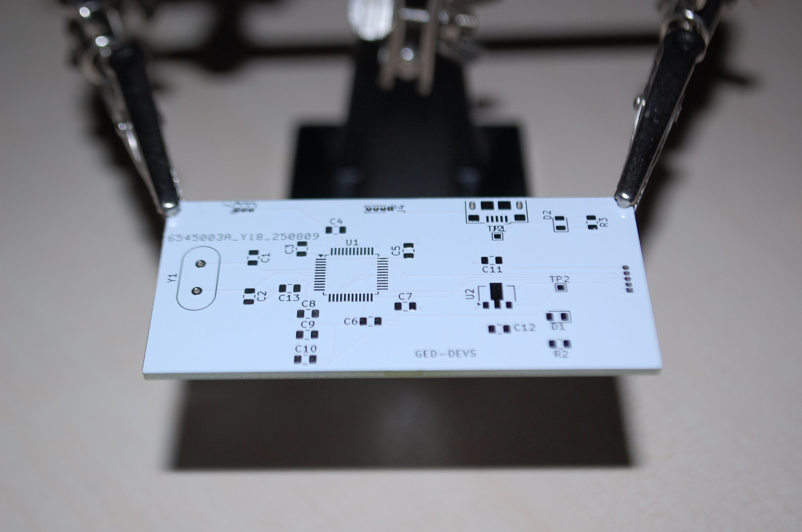
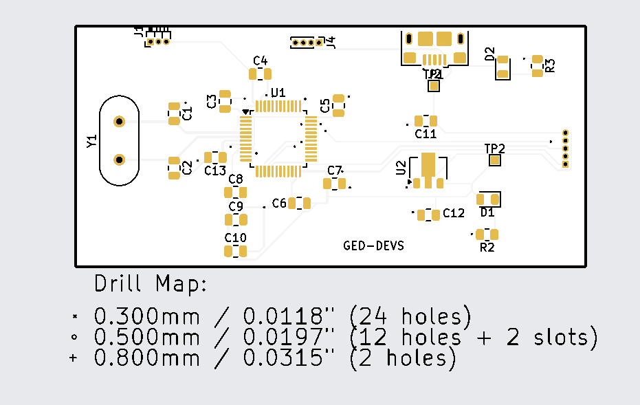

# STM32 Audio visualizer DOT MATRIX

Audio Visualizer based on STM32 bluepill utilizing Fast FFT and hacky trick to make the Matrix LED working nicely together. 

## Compact Size

Made a small Add-on type PCB that laches on the back of the  LED matrix.

## Components 
The Audio Visualizer features Real-time audio visualization with Fast Fourier Transform (FFT) to accurately visualize real audio frequencies rather than just detecting high or low noise levels.

* STM32 Bluepill
* MAX4466 Microphone Module
* 8x8 Matrix LED * 4

## Software Used

* [Kicad](https://www.kicad.org/) : PCB Design 
* [STM32MAX](https://www.st.com/en/development-tools/stm32cubemx.html) : Project Configurator 
* [T-filter](http://t-filter.engineerjs.com/) : Desgning Fir filter

## Tools Used

* Lab power supply
* Oscilloscope 
* ST-LINK/V2 debugger

